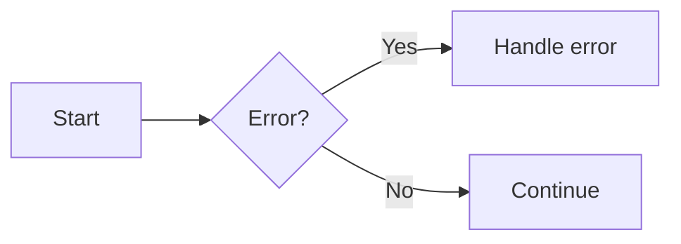
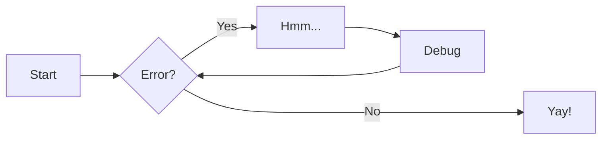
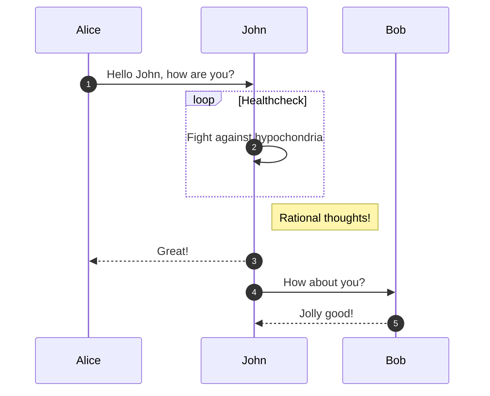
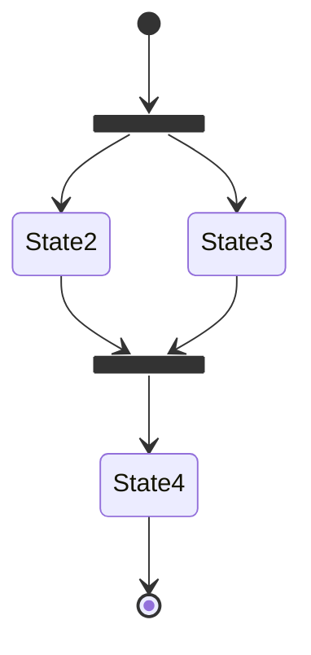
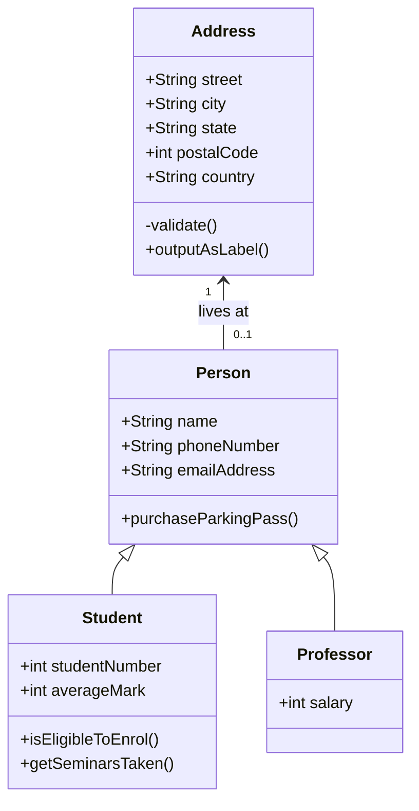
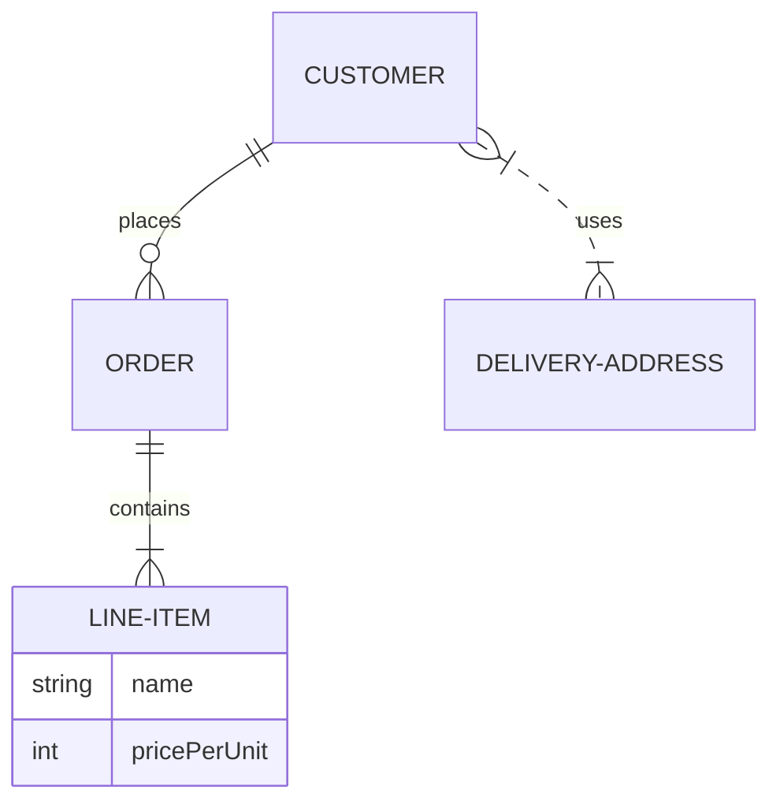

# Diagrams

Material for MkDocs integrates with `Mermaid.js` to render **diagrams** from fenced code blocks. Diagrams can express flowcharts, sequence diagrams, state machines, class diagrams, ER diagrams and more.

---

## Diagrams Design Standards

!!! success "Dos"
    - **Do** choose the diagram type that best fits the information (flowchart for processes, sequence for interactions, ER for data models).
    - **Do** keep diagram text short and labels consistent for readability.
    - **Do** prefer simplified diagrams on documentation pages and link to larger diagrams if necessary.

!!! failure "Don'ts"
    - **Don’t** put very large or dense diagrams directly into pages — consider an image or separate documentation page.
    - **Don’t** rely on color alone to convey meaning; use shapes, labels and legends.

---

## Using Diagrams

Enable a Mermaid fence and add a `mermaid` fenced block in Markdown. Material will auto-initialize Mermaid when it detects a `mermaid` block (when `pymdownx.superfences` is configured).

### Flowchart example

Flowcharts are diagrams that represent workflows or processes. The steps are rendered as nodes of various kinds and are connected by edges, describing the necessary order of steps:



```md
    ```mermaid
    graph LR
      A[Start] --> B{Error?}
      B -->|Yes| C[Handle error]
      B -->|No| D[Continue]
    ```
```



```md
    ``` mermaid
    graph LR
      A[Start] --> B{Error?};
      B -->|Yes| C[Hmm...];
      C --> D[Debug];
      D --> B;
      B ---->|No| E[Yay!];
    ```
```

### Sequence diagram example

Sequence diagrams describe a specific scenario as sequential interactions between multiple objects or actors, including the messages that are exchanged between those actors:



```md
    ``` mermaid
    sequenceDiagram
      autonumber
      Alice->>John: Hello John, how are you?
      loop Healthcheck
          John->>John: Fight against hypochondria
      end
      Note right of John: Rational thoughts!
      John-->>Alice: Great!
      John->>Bob: How about you?
      Bob-->>John: Jolly good!
    ```
```

### State diagram example

State diagrams are a great tool to describe the behavior of a system, decomposing it into a finite number of states, and transitions between those states:

```md
    ``` mermaid
    stateDiagram-v2
      state fork_state <<fork>>
        [*] --> fork_state
        fork_state --> State2
        fork_state --> State3

        state join_state <<join>>
        State2 --> join_state
        State3 --> join_state
        join_state --> State4
        State4 --> [*]
    ```
```



### Class diagram example

Class diagrams are central to object oriented programming, describing the structure of a system by modelling entities as classes and relationships between them:



```md
    ``` mermaid
    classDiagram
      Person <|-- Student
      Person <|-- Professor
      Person : +String name
      Person : +String phoneNumber
      Person : +String emailAddress
      Person: +purchaseParkingPass()
      Address "1" <-- "0..1" Person:lives at
      class Student{
        +int studentNumber
        +int averageMark
        +isEligibleToEnrol()
        +getSeminarsTaken()
      }
      class Professor{
        +int salary
      }
      class Address{
        +String street
        +String city
        +String state
        +int postalCode
        +String country
        -validate()
        +outputAsLabel()
      }
    ```
```

### Entity-Relationship diagram example

An entity-relationship diagram is composed of entity types and specifies relationships that exist between entities. It describes inter-related things in a specific domain of knowledge:



```md
    ``` mermaid
    erDiagram
      CUSTOMER ||--o{ ORDER : places
      ORDER ||--|{ LINE-ITEM : contains
      LINE-ITEM {
        string name
        int pricePerUnit
      }
      CUSTOMER }|..|{ DELIVERY-ADDRESS : uses
    ```
```

Notes:

- Mermaid supports many more diagram types (gantt, pie, gitgraph, etc.), but Material only adjusts fonts and colors reliably for flowcharts, sequence, state, class and ER diagrams.
- If you need advanced Mermaid plugins (e.g., ELK layouts) you can register additional layout loaders via a custom JS module (see Customization below).

---

## Creating Custom Diagrams

- Mermaid diagrams inherit theme fonts and colors; override via additional CSS if necessary.
- For very large or complex diagrams, export as SVG and include the SVG (or an image) with an accessible caption.

---

## Setting Up Diagrams

To enable native Mermaid support add a custom fence for `mermaid` to `pymdownx.superfences` in `mkdocs.yml` (Material recommends this configuration):

```yaml
markdown_extensions:
  - pymdownx.superfences:
      custom_fences:
        - name: mermaid
          class: mermaid
          format: !!python/name:pymdownx.superfences.fence_code_format
```

No further configuration is required — Material will initialise Mermaid automatically and make diagrams work with instant-loading.

Optional customizations:

- Add a small custom JavaScript module to register Mermaid plugins or change initialisation options (for example to register ELK layout loaders).
- Use additional CSS to tweak diagram fonts and colors; Material applies theme-aware colors by default.

Example custom JS to register ELK layouts (place in `docs/javascripts/mermaid.mjs` and include via `extra_javascript`):

```js
import mermaid from 'https://cdn.jsdelivr.net/npm/mermaid@11/dist/mermaid.esm.min.mjs';
import elkLayouts from 'https://cdn.jsdelivr.net/npm/@mermaid-js/layout-elk@0/dist/mermaid-layout-elk.esm.min.mjs';

mermaid.registerLayoutLoaders(elkLayouts);
mermaid.initialize({ startOnLoad: false, securityLevel: 'loose', layout: 'elk' });
window.mermaid = mermaid; // make available to Material
```

---

??? quote "References"
    - [Material for MkDocs — Diagrams reference](https://squidfunk.github.io/mkdocs-material/reference/diagrams/)
